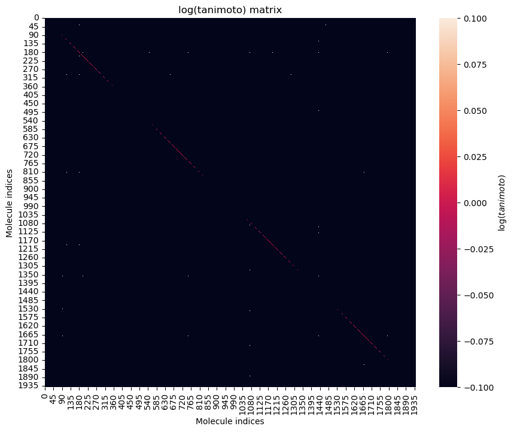

# LEARNING ADMET SCORES FROM SMILES FINGERPRINTS.
This project stems from the ENS chemistry department's Data Challenge 2024. The objective is to predict ADMET scores from the SMILES fingerprints of about 2000 molecules. 

Although this was not submitted as a solution to the challenge due to time constraints, I've documented here my progress and trial solutions. Below you'll find how to create the conda environment that I used and how to set up your system to replicate the findings.

## Data analysis.
To start, we'd like to know if there is any structure on the dataset that can be exploited. To do so, we encode the molecules in Morgan (r=2) fingerprints, and use them to compute a Tanimoto similarity matrix. The visualization of the logarithm of this tanimoto similarity matrix does not evidence any obvious blocks of correlated molecules.

Still, this is heavily dependent on the ordering of the molecules, which may hide the presence of the clusters. Thus, we use hierarchical clustering using the already computed Tanimoto distance. To find the optimum number of clusters to divide the dataset, we search for an equilibrium of "compactness" within each group as well as mutual separation between the groups. This leads to the *silhouette* score, which is implemented already in scikit-learn. A silhouette score close to +1 indicates very efficient grouping. A silhouette close to 0 indicates that groups may not be present. A negative silhouette score indicates that the groups are not only "doubtful", but ill defined. A loop iterating over different cluster numbers is implemented in the data analysis notebook to compute this score for a range of cluster numbers. We find:

which indicates that, in fact, the optimum number of clusters is 1, that is, all the molecules that we have are equally similar (or dissimilar), and there is no exploitable structure in our dataset.

## Model definition.
As we cannot exploit structure in the dataset, all that is left is to define a good model and try to make it work with a good molecular fingerprint. We consider the following
- We have 2000 data points, which is not a lot and may be insufficient for a neural network.